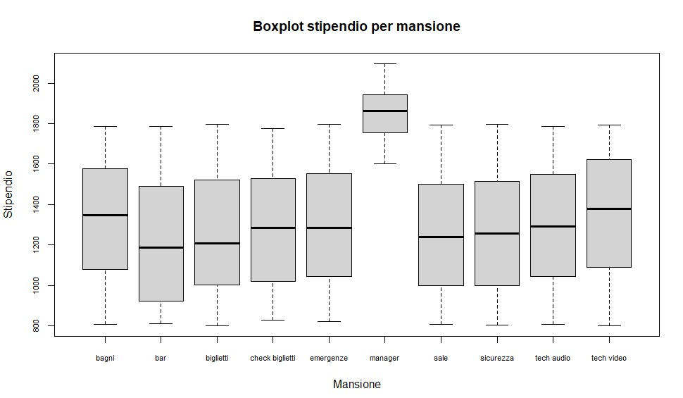
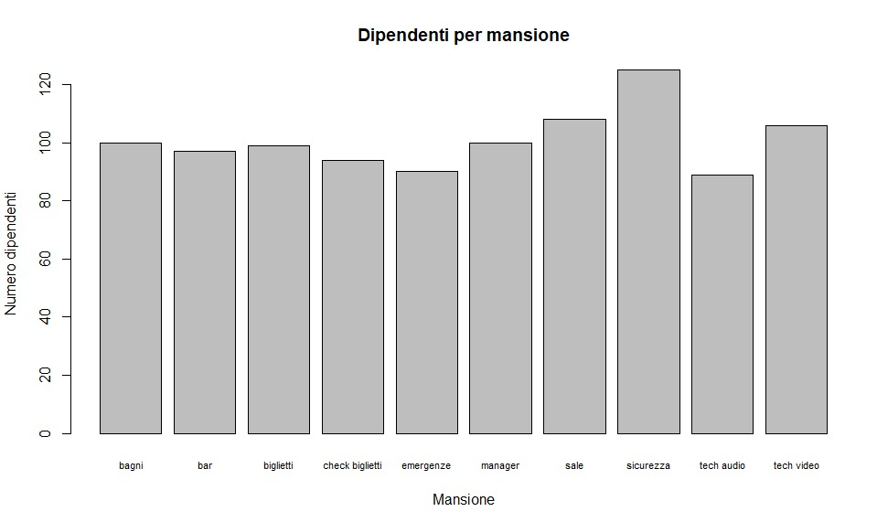
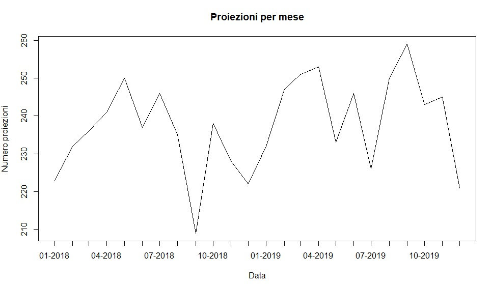
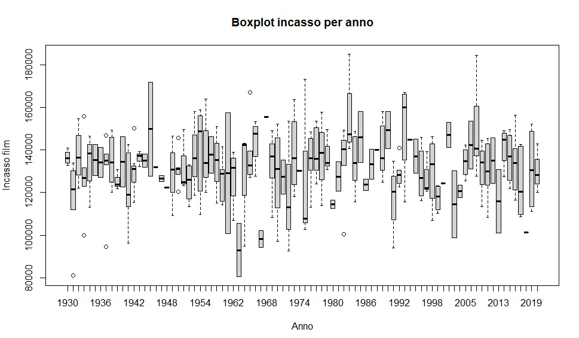
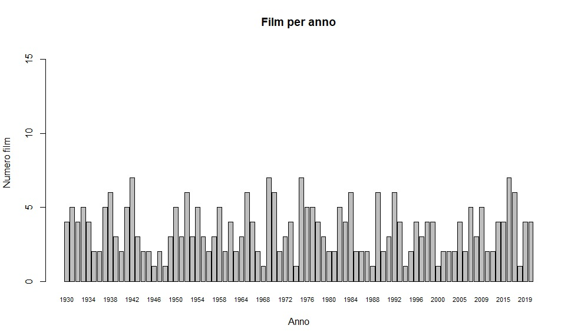

#### De Marchi Daniele (Mat. 130654), Zanin Simone (Mat. 140833)
# Progetto di laboratorio di Basi di Dati
  
## Introduzione
---

### Consegna

In questo progetto è stata studiata una soluzione per il seguente esercizio:  

> Si vuole progettare una base di dati di supporto alla gestione di una rete di cinema multisala di proprietà di un’unica società.  
La società possiede più cinema, in diverse città italiane. Ogni cinema è identificato univocamente da un codice ed è caratterizzato da un nome, da un manager, da un recapito telefonico e dalla città in cui si trova. Ogni sala di un cinema è contraddistinta da un numero (sala numero 1, sala numero 2, ...) e possiede una superficie, espressa in metri quadrati, e una capienza (150 posti, 200 posti, ...).  
Oltre ai manager dei vari cinema, la società dispone di altro personale (addetti alla proiezione, addetti alla biglietteria, addetti alle pulizie, ...), che può lavorare presso più cinema (non necessariamente tutti).  
Ogni film è identificato da un codice. Di ogni film vengono registrati il titolo, il nome del regista, l’anno di produzione e la nazione in cui è stato prodotto (si assuma che non vi siano coproduzioni internazionali) e la lunghezza in minuti.  
Si vuole, inoltre, tener traccia delle proiezioni dei vari film nei vari cinema. Di ogni proiezione vogliamo memorizzare la sala, il giorno, l’orario e il prezzo (si assuma che proiezioni diverse dello stesso film o di film diversi possano avere prezzi diversi).  
Si vuole anche tener traccia di alcune informazioni relative alle principali star cinematografiche. Di ognuna vengono memorizzati il nome (che le identifica univocamente), l’anno di nascita, il sesso e la nazionalità.
Infine, si registrano informazioni sul cast di ogni film, che riportano le star che vi partecipano e il loro ruolo (attrice protagonista, attore non protagonista, comparsa, ...).

### Software Utilizzati

Nella realizzazione del progetto sono stati utilizzati diversi software.  
Per la base di dati stessa è stato costruito un server self-hosted di *PostgreSQL*, con la quale abbiamo interagito attraverso *PgAdmin4*.  
Il modello ER è stato sviluppato attraverso l'applicazione *ChronoGeoGraph*, modificata da noi per risolvere alcune problematiche in essa presenti.  
Il riempimento delle tabelle è stato effettuato tramite un programma *Java* creato appositamente.  
L'analisi statistica è stata effettuata con il linguaggio *R*.  
La produzione del documento corrente è stata fatta tramite il linguaggio *MD*, renderizzato attraverso l'applicativo *Okular*.

## Progettazione Concettuale
---

### Analisi dei requisiti

Il database sembra destinato al mantenimento di dati a scopo storico e statistico, più che ad una vera gestione interna delle prenotazioni e dei film: infatti non vengono menzionati biglietti e posti assegnati, ma solo dati generici sulla singola proiezione. Tra le altre scelte fatte per arricchire la consegna, abbiamo pensato, in questo ambito, di inserire un dato sul numero totale di posti occupati, in maniera da avere un possibile confronto con la capienza della sala e poter trarre delle conclusioni sulla popolarità del film.  
Per quanto riguarda la rappresentazione del personale e dei manager, abbiamo discusso sul metodo migliore per rendere il fatto che entrambi sono esseri umani associati agli stessi tipi di dato e, a livello di relazioni, abbiamo optato per una generalizzazione delle entità Dipendente e Manager in una super-entità definita Lavoratore. Viene inoltre inserita una relazione che tenga traccia delle mansioni passate dei dipendenti.  
In totale sono state inserite 8 entità (Lavoratore, Dipendente, Manager, Cinema, Sala, Proiezione, Film e Attore) e 8 relazioni tra essi.  
Altri tipi di aggiunte alla consegna verranno discussi più tardi, nei loro specifici ambiti.  

### Modello E/R

La compilazione del modello ER è stata organica, per la maggior parte seguendo passo a passo le indicazioni dell’esercizio, e arricchendolo man mano che nuove idee su possibili utilizzi emergevano dal confronto interno al gruppo di lavoro.  

Dei punti salienti notevoli sono, per esempio:

+ La generalizzazione di manager e dipendente ad una super-entità in comune;  
+ La progettazione dell’entità Sala come un’entità debole basata sull’entità Cinema;  
+ L’inserimento di una relazione riflessiva “Sequel di” dell’entità Film;  
+ L’inserimento di molteplici attributi derivati, discussi in seguito;  

## Progettazione Logica
---
 
### Analisi delle ridondanze e campi derivati

È stata innanzitutto redatta la tabella dei volumi, secondo dei numeri ipotizzati secondo quello che al momento poteva sembrare verosimile.

| Concetto          | Tipo | Volume |
| ----------------- | ---- | ------ |
| Cinema            | E    | 5      |
| Appartiene        | R    | 25     |
| Sala              | E    | 25     |
| Dipendente        | E    | 250    |
| Manager           | E    | 5      |
| Gestisce          | R    | 5      |
| Impieghi correnti | R    | 100    |
| Storico impieghi  | R    | 400    |
| Proiezione        | E    | 35,000 |
| Proiettato in     | R    | 35,000 |
| Film              | E    | 500    |
| Proiezione di     | R    | 35,000 |
| Attore            | E    | 2,000  |
| Partecipa         | R    | 6,000  |
| Sequel di         | R    | 20     |

Si procede col calcolare, per ogni dato ridondante, se sia o no opportuno inserirlo.

<---------------------------------------------------------------------- x ---------------------------------------------------------------------->

#### Dipendenti totali nella tabella cinema: 

| Operazione                     | Frequenza      |
| ------------------------------ | -------------- |
| Aggiunta relazione "lavora in" | 10 a settimana |
| Stampare tutti dati cinema     | 35 a settimana |

+ Con ridondanza: 

| Operazione     | Concetto  | Accessi | Tipo        |
| -------------- | --------- | ------- | ----------- |
| Op 1           | Lavora in | 1       | S           |
|                | Cinema    | 1       | S           |
|                |           |         |             |
| Op 2           | Cinema    | 1       | L           |

 Totale: 75 accessi a settimana

+ Senza ridondanza: 

| Operazione       | Concetto  | Accessi | Tipo  |
| ---------------- | --------- | ------- | ----- |
| Op 1             | Lavora in | 1       | S     |
|                  |           |         |       |
| Op 2             | Cinema    | 1       | L     |
|                  | Lavora in | 20      | L     |

 Totale: 75 accessi a settimana

<---------------------------------------------------------------------- x ---------------------------------------------------------------------->

#### Proiezioni dei film:

 

| Operazione                     | Frequenza     |
| ------------------------------ | ------------- |
| Aggiunta proiezione di un film | 100 al giorno |
| Stampa tutti i dati di un film | 25 al giorno  |

+ Con ridondanza: 

| Operazione     | Concetto   | Accessi | Tipo      |
| -------------- | ---------- | ------- | --------- |
| Op 1           | Proiezione | 1       | S         |
|                | Proiettato | 1       | S         |
|                | Film       | 1       | S         |
|                |            |         |           |
| Op 2           | Film       | 1       | L         |

 Totale: 625 accessi al giorno

+ Senza ridondanza: 

| Operazione       | Concetto   | Accessi | Tipo        |
| ---------------- | ---------- | ------- | ----------- |
| Op 1             | Proiezione | 1       | S           |
|                  | Proiettato | 1       | S           |
|                  |            |         |             |
| Op 2             | Film       | 1       | L           |
|                  | Proiettato | 70      | L           |

 Totale: 2,175 accessi al giorno

<---------------------------------------------------------------------- x ---------------------------------------------------------------------->

#### Partecipazione degli attori:

 

| Operazione                   | Frequenza       |
| ---------------------------- | --------------- |
| Aggiunta relazione partecipa | 120 a settimana |
| Stampa tutti dati attore     | 70 a settimana  |

+ Con ridondanza: 

| Operazione     | Concetto  | Accessi | Tipo        |
| -------------- | --------- | ------- | ----------- |
| Op 1           | Partecipa | 1       | S           |
|                | Film      | 1       | S           |
|                |           |         |             |
| Op 2           | Attore    | 1       | L           |

 Totale: 550 accessi a settimana

+ Senza ridondanza: 

| Operazione       | Concetto  | Accessi | Tipo        |
| ---------------- | --------- | ------- | ----------- |
| Op 1             | Partecipa | 1       | S           |
|                  |           |         |             |
| Op 2             | Attore    | 1       | L           |
|                  | Partecipa | 3       | L           |

 Totale: 520 accessi a settimana 

<---------------------------------------------------------------------- x ---------------------------------------------------------------------->

#### Capienza della sala:

*Ipotizzando un update ad ogni vendita di biglietto, e in media 80 biglietti venduti per proiezione, venduti 2 per volta.  
Quindi totale 40 update per proiezione.  
Se invece il dato dei biglietti venduti non viene mai aggiornato o, raramente aggiornato, la ridondanza non ha senso.*
 

| Operazione                            | Frequenza |
| ------------------------------------- | --------- |
| Aggiunta proiezione con relativa sala | 100 al giorno      |
| Update biglietti venduti              | 4,000 al giorno    |

+ Con ridondanza: 

| Operazione     | Concetto      | Accessi | Tipo      |
| -------------- | ------------- | ------- | --------- |
| Op 1           | Sala          | 1       | L         |
|                | Proiezione    | 1       | S         |
|                | Proiettato in | 1       | S         |
|                |               |         |           |
| Op 2           | Proiezione    | 1       | S         |

 Totale: 8,500 accessi al giorno

+ Senza ridondanza: 

| Operazione       | Concetto      | Accessi | Tipo      |
| ---------------- | ------------- | ------- | --------- |
| Op 1             | Proiezione    | 1       | S         |
|                  | Proiettato in | 1       | S         |
|                  |               |         |           |
| Op 2             | Proiezione    | 1       | S         |
|                  | Proiettato in | 1       | L         |
|                  | Sala          | 1       | L         |

 Totale: 16,400 accessi al giorno

<---------------------------------------------------------------------- x ---------------------------------------------------------------------->

#### Incasso totale per film:
*Ipotizzando un update ad ogni vendita di biglietto*
 

| Operazione                                        | Frequenza          |
| ------------------------------------------------- | ------------------ |
| Aggiunta proiezione con relativo film             | 100 al giorno |
| Update biglietti venduti con aumento incasso film | 4,000 al giorno |
| Stampare dati film, compreso incasso              | 25 al giorno |

+ Con ridondanza: 

| Operazione     | Concetto      | Accessi | Tipo      |
| -------------- | ------------- | ------- | --------- |
| Op 1           | Proiezione    | 1       | S         |
|                | Proiezione di | 1       | S         |
|                |               |         |           |
| Op 2           | Proiezione    | 1       | S         |
|                | Proiezione di | 1       | L         |
|                | Film          | 1       | S         |
|                |               |         |           |
| Op 3           | Film          | 1       | L         |

 Totale: 20,425 accessi al giorno

+ Senza ridondanza: 

| Operazione       | Concetto      | Accessi | Tipo      |
| ---------------- | ------------- | ------- | --------- |
| Op 1             | Proiezione    | 1       | S         |
|                  | Proiezione di | 1       | S         |
|                  |               |         |           |
| Op 2             | Proiezione    | 1       | S         |
|                  |               |         |           |
| Op 3             | Film          | 1       | L         |
|                  | Proiezione di | 70      | L         |
|                  | Proiezione    | 70      | L         |

 Totale: 11,925 accessi al giorno

<---------------------------------------------------------------------- x ---------------------------------------------------------------------->

#### Dato biglietti venduti raramente modificato:
 

| Operazione                                              | Frequenza          |
| ------------------------------------------------------- | ------------------ |
| Aggiunta proiezione con relativo film e aumento incasso | 100 al giorno |
| Stampare dati film, compreso incasso                    | 25 al giorno |

+ Con ridondanza: 

| Operazione     | Concetto      | Accessi | Tipo      |
| -------------- | ------------- | ------- | --------- |
| Op 1           | Proiezione    | 1       | S         |
|                | Proiezione di | 1       | S         |
|                | Film          | 1       | S         |
|                |               |         |           |
| Op 2           | Film          | 1       | L         |
|                |               |         |           |

 Totale: 625 accessi al giorno

+ Senza ridondanza: 

 | Operazione       | Concetto      | Accessi | Tipo      |
 | ---------------- | ------------- | ------- | --------- |
 | Op 1             | Proiezione    | 1       | S         |
 |                  | Proiezione di | 1       | S         |
 |                  |               |         |           |
 | Op 2             | Film          | 1       | L         |
 |                  | Proiezione di | 70      | L         |
 |                  | Proiezione    | 70      | L         |
 
   Totale: 3,925 accessi al giorno

  <---------------------------------------------------------------------- x ---------------------------------------------------------------------->
  

### Eliminazione delle generalizzazioni

Nel modello ER è presente una singola generalizzazione.  
Durante la progettazione sono state considerate diverse soluzioni, tra cui

- il mantenimento delle due entità in modo separato per consentire una facile manutenzione dei vincoli di integrità per i manager;  
- l'inserimento nella tabella cinema di un campo con chiave esterna non nulla verso un dipendente, che sarebbe dunque il manager per tale cinema;

Abbiamo tuttavia optato per un approccio più vicino a quello che abbiamo considerato la realtà, ovvero che il manager altro non è che un dipendente con una mansione particolare, per la quale esistono dei vincoli extra da garantire.  
Utilizzare questo genere di astrazione del ruolo ci consente, come effetto collaterale, di tenere traccia di manager passati nello storico impieghi, cosa che non era prevista nel modello ER iniziale, mentre la perdita di efficienza dovuta alla ricerca in una tabella più popolosa rimane comunque giustificata dal fatto che una ricerca sul singolo manager è relativamente rara nell'uso previsto.

### Vincoli di integrità e Trigger

Sono stati individuati molti casi critici per l'integrità del database, che sono stati risolti attraverso l'inserimento di opportuni trigger e constraint all'interno della base di dati:

- In ogni dato istante può essere presente uno ed un solo manager per ogni cinema.  
Questo è stato risolto facendo in modo che il manager non possa essere eliminato, ma solo sostituito, processo nel quale viene spostato quello vecchio nello storico impieghi.

- Non possono coesistere due proiezioni in contemporanea nella stessa stanza. Viene inoltre garantito un periodo di grazia minimo di 30 minuti per consentire al personale la pulizia dei locali.

- La capienza di una sala non può essere superata dalle persone che la utilizzano.

- Nessun ID assegnato automaticamente dovrebbe essere modificato manualmente.

- Lo storico impieghi non può essere manomesso, in quanto viene popolato automaticamente quando un impiego viene rimosso.

- Nessun campo di ridondanza calcolato automaticamente può essere modificato manualmente.

- La valutazione di un film è stata codificata come un tipo custom, detto stars, che è un intero compreso fra 0 e 10 inclusi, che può essere agilmente convertito per esempio in una valutazione a 5 stelle con precisione fino a mezza stella.

## Progettazione fisica

---

La progettazione fisica dell'esercizio può essere trovata al seguente indirizzo:  
> https://github.com/DanieleDeMarchi/basi-di-dati  

La creazione del database è stata effettuata eseguendo, nell'ordine indicato dal nome, gli script SQL presenti nella radice del progetto. L'inserimento di dati pseudo casuali è stato invece effettuato attraverso un programma Java, sempre incluso nel progetto all'interno della directory `riempimento_auto`, che utilizza elenchi di dati estrapolati da varie fonti recuperate online e successivamente elaborate manualmente.

### Tabelle create

Sono state create le seguenti tabelle:

- *cinema*(<u>id</u>, citta, nome, telefono, **totale_dipendenti**)
- *sale*(<u>numerosala</u>, *<u>idcinema</u>*, superficie, capienza)
- *film*(<u>id</u>, durata, regia, genere, anno, rating, titolo, nazione, *sequel_di*, **proiezioni_totali**)
- *attori*(<u>cf</u>, nome)
- *proiezioni*(<u>id</u>, costo, vendite, datetime, *idfilm*, *idsala*, *idcinema*, **capienza_sala**, **fine_proiezione**)
- *dipendenti*(<u>cf</u>, nome, telefono)
- *impieghi_correnti*(<u>*cfdipendente*</u>, <u>*idcinema*</u>, <u>mansione</u>, inizio, stipendio)
- *storico_impieghi*(<u>*cfdipendente*</u>, <u>*idcinema*</u>, <u>mansione</u>, <u>inizio</u>, <u>fine</u>)

(Sono riportate in corsivetto le chiavi esterne, in grassetto gli attributi derivati, sottolineate le parti della chiave primaria)

### Scelte implementative

Nelle tabelle riguardanti gli impieghi la scelta della chiave primaria è stata dettata dal fatto che, secondo il modello da noi scelto, un dipendente che ha più mansioni all'interno dello stesso cinema figura più volte nei dati delle tabelle. In questo modo per gli impieghi correnti un dato dipendente può svolgere una mansione solo una volta in un dato cinema in ogni dato istante. Infatti, se dovesse essere ri-assunto in futuro, le mansioni vecchie saranno state eliminate dalla tabella e trasferite in *storico_impieghi*, dove invece anche la data di inizio fa fede per la chiave primaria.

### Indici 

La scelta di indici è stata fatta sulla base degli attributi su cui si fanno più spesso ordinamenti e selezioni.  
Sono stati creati in tutto 3 indici:

+ La data di una proiezione, giustificata dal fatto che spesso si andranno a cercare proiezioni di specifiche giornate per una ricerca mirata oppure settimane/mesi per analisi statistiche, considerando anche il fatto che ci aspettiamo che questa sia la tabella a espansione più rapida tra tutte quelle inserite;

+ Il cinema in cui un dipendente ha un impiego, giustificato dal fatto che spesso gli accessi a questa tabella saranno fatti sulla base del personale del singolo cinema piuttosto che in generale sul territorio nazionale;

+ Per lo stesso motivo, è più facile che la ricerca di un dipendente avvenga per nome, invece che per codice fiscale. Viene dunque creato un indice sul nome;

Era stata considerata l'opzione di inserire alcuni indici su alcune chiavi che vengono spesso utilizzate per fare i Join, tuttavia queste chiavi sono sempre esterne, il che vuol dire che nella tabella a cui fanno riferimento sono chiavi primarie, per loro natura già indicizzate. Dato che siamo già in grado di fornire delle strategie d'accesso efficaci quando una sola delle due tabelle ha un indice sulla chiave, si è optato per non includerle nel database finale, per evitare un aggravio inutile sulle risorse.

## Analisi dei dati
---

Sono stati prodotti alcuni grafici esemplificativi per alcune query ipotizzate attraverso il linguaggio R.  
I dati contenuti nella base di dati al momento della loro raccolta sono generati automaticamente e casualmente attraverso il programma citato in precedenza, non ci sono dunque particolari distribuzioni, per esempio, nella quantità di film per anno, o aumenti nell'incasso al botteghino negli anni, nonostante il rincaro dei prezzi dei biglietti e l'aumento contemporaneo delle loro vendite.

