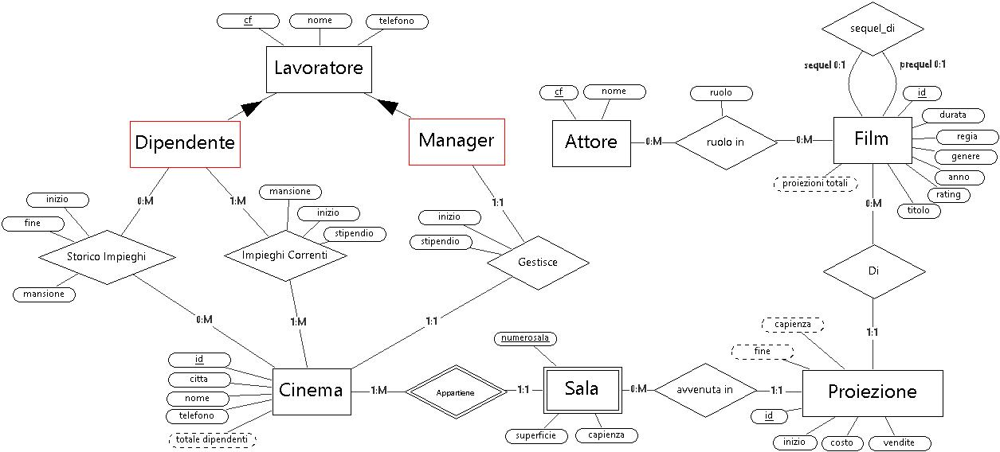
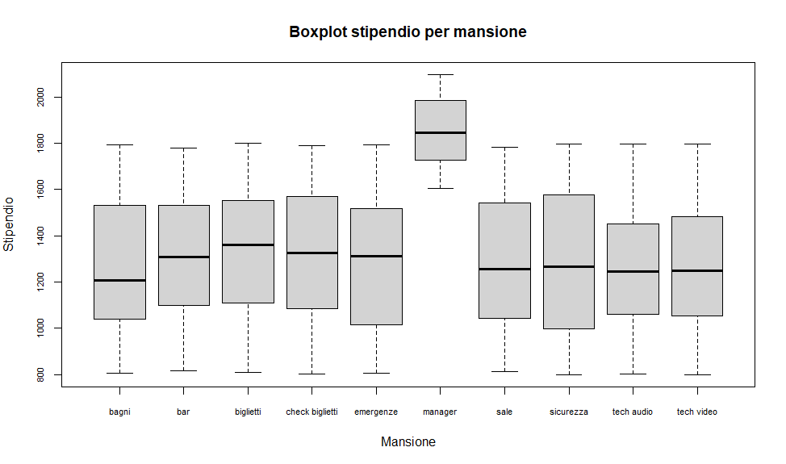
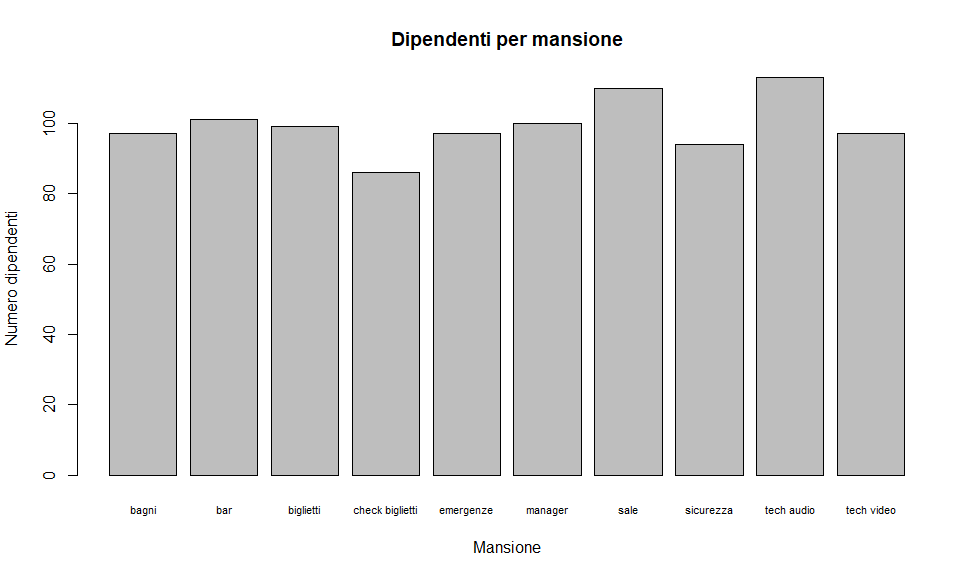
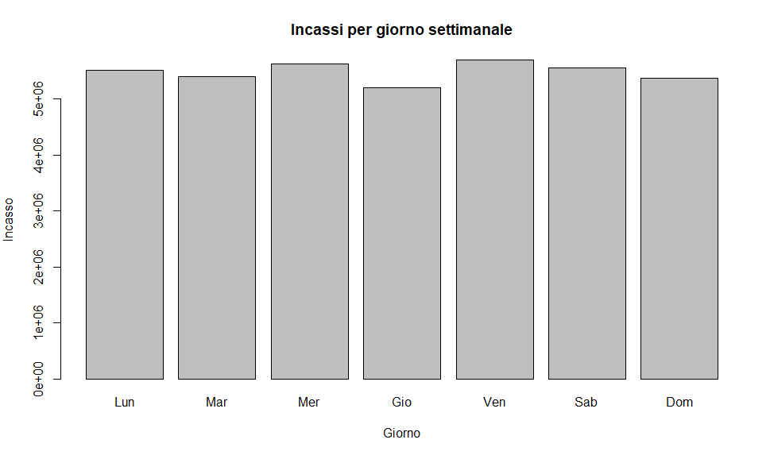
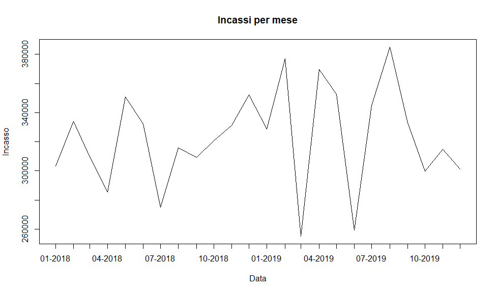
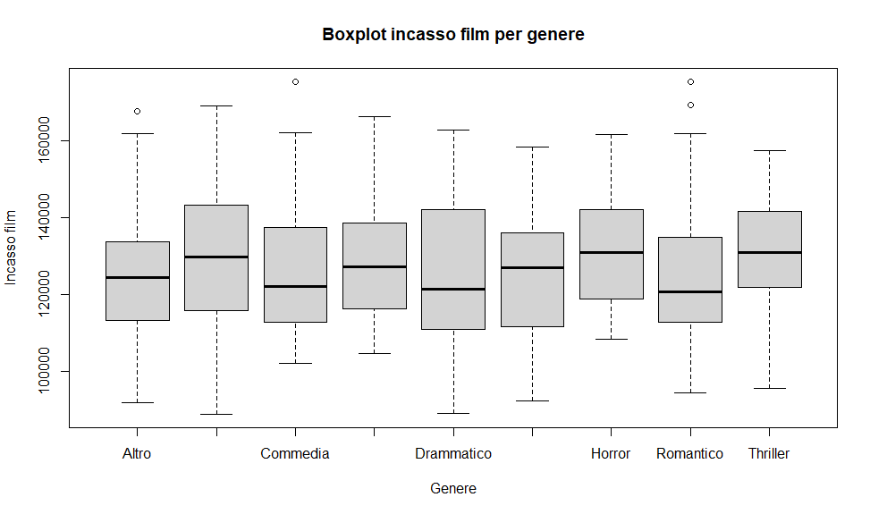
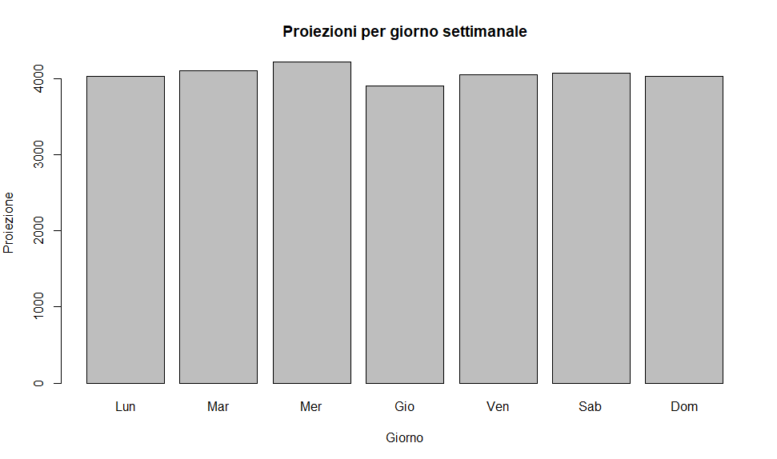
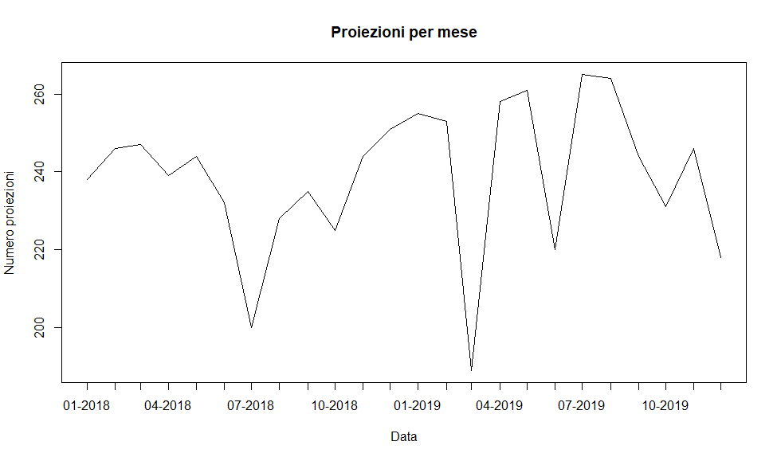

#### De Marchi Daniele (Mat. 130654), Zanin Simone (Mat. 140833)
# Progetto di laboratorio di Basi di Dati
  
## Introduzione
---

### Consegna

In questo progetto è stata studiata una soluzione per il seguente esercizio:  

> Si vuole progettare una base di dati di supporto alla gestione di una rete di cinema multisala di proprietà di un’unica società.  
La società possiede più cinema, in diverse città italiane. Ogni cinema è identificato univocamente da un codice ed è caratterizzato da un nome, da un manager, da un recapito telefonico e dalla città in cui si trova. Ogni sala di un cinema è contraddistinta da un numero (sala numero 1, sala numero 2, ...) e possiede una superficie, espressa in metri quadrati, e una capienza (150 posti, 200 posti, ...).  
Oltre ai manager dei vari cinema, la società dispone di altro personale (addetti alla proiezione, addetti alla biglietteria, addetti alle pulizie, ...), che può lavorare presso più cinema (non necessariamente tutti).  
Ogni film è identificato da un codice. Di ogni film vengono registrati il titolo, il nome del regista, l’anno di produzione e la nazione in cui è stato prodotto (si assuma che non vi siano coproduzioni internazionali) e la lunghezza in minuti.  
Si vuole, inoltre, tener traccia delle proiezioni dei vari film nei vari cinema. Di ogni proiezione vogliamo memorizzare la sala, il giorno, l’orario e il prezzo (si assuma che proiezioni diverse dello stesso film o di film diversi possano avere prezzi diversi).  
Si vuole anche tener traccia di alcune informazioni relative alle principali star cinematografiche. Di ognuna vengono memorizzati il nome (che le identifica univocamente), l’anno di nascita, il sesso e la nazionalità.
Infine, si registrano informazioni sul cast di ogni film, che riportano le star che vi partecipano e il loro ruolo (attrice protagonista, attore non protagonista, comparsa, ...).

### Software Utilizzati

Nella realizzazione del progetto sono stati utilizzati diversi software.  
Per la base di dati stessa è stato costruito un server self-hosted di *PostgreSQL*, con la quale abbiamo interagito attraverso *PgAdmin4*.  
Il modello ER è stato sviluppato attraverso l'applicazione *ChronoGeoGraph*, modificata da noi per risolvere alcune problematiche in essa presenti.  
Il riempimento delle tabelle è stato effettuato tramite un programma *Java* creato appositamente.  
L'analisi statistica è stata effettuata con il linguaggio *R*.  
La produzione del documento corrente è stata fatta tramite il linguaggio *MD*, renderizzato attraverso l'applicativo *Okular*.

## Progettazione Concettuale
---

### Analisi dei requisiti

Il database sembra destinato al mantenimento di dati a scopo storico e statistico, più che ad una vera gestione interna delle prenotazioni e dei film: infatti non vengono menzionati biglietti e posti assegnati, ma solo dati generici sulla singola proiezione. Tra le altre scelte fatte per arricchire la consegna, abbiamo pensato, in questo ambito, di inserire un dato sul numero totale di posti occupati, in maniera da avere un possibile confronto con la capienza della sala e poter trarre delle conclusioni sulla popolarità del film.  
Per quanto riguarda la rappresentazione del personale e dei manager, abbiamo discusso sul metodo migliore per rendere il fatto che entrambi sono esseri umani associati agli stessi tipi di dato e, a livello di relazioni, abbiamo optato per una generalizzazione delle entità Dipendente e Manager in una super-entità definita Lavoratore. Viene inoltre inserita una relazione che tenga traccia delle mansioni passate dei dipendenti.  
In totale sono state inserite 8 entità (Lavoratore, Dipendente, Manager, Cinema, Sala, Proiezione, Film e Attore) e 8 relazioni tra essi.  
Altri tipi di aggiunte alla consegna verranno discussi più tardi, nei loro specifici ambiti.  

### Modello E/R

La compilazione del modello ER è stata organica, per la maggior parte seguendo passo a passo le indicazioni dell’esercizio, e arricchendolo man mano che nuove idee su possibili utilizzi emergevano dal confronto interno al gruppo di lavoro.  

Dei punti salienti notevoli sono, per esempio:

+ La generalizzazione di manager e dipendente ad una super-entità in comune;  
+ La progettazione dell’entità Sala come un’entità debole basata sull’entità Cinema;  
+ L’inserimento di una relazione riflessiva “Sequel di” dell’entità Film;  
+ L’inserimento di molteplici attributi derivati, discussi in seguito;  

Per quanto riguarda la molteplicità delle relazioni, l'unica nota da fare riguarda la relazione "ruolo in", che contempla film senza attori (animazione, documentari...) e attori che non hanno mai recitato (debuttanti, persone che hanno solo partecipato a casting...)

## Progettazione Logica
---
 
### Analisi delle ridondanze e campi derivati

È stata innanzitutto redatta la tabella dei volumi, secondo dei numeri ipotizzati secondo quello che al momento poteva sembrare verosimile.

| Concetto          | Tipo | Volume |
| ----------------- | ---- | ------ |
| Cinema            | E    | 5      |
| Appartiene        | R    | 25     |
| Sala              | E    | 25     |
| Dipendente        | E    | 250    |
| Manager           | E    | 5      |
| Gestisce          | R    | 5      |
| Impieghi correnti | R    | 100    |
| Storico impieghi  | R    | 400    |
| Proiezione        | E    | 35,000 |
| Proiettato in     | R    | 35,000 |
| Film              | E    | 500    |
| Proiezione di     | R    | 35,000 |
| Attore            | E    | 2,000  |
| Partecipa         | R    | 6,000  |
| Sequel di         | R    | 20     |

Si procede col calcolare, per ogni dato ridondante, se sia o no opportuno inserirlo.

<---------------------------------------------------------------------- x ---------------------------------------------------------------------->

#### Dipendenti totali nella tabella cinema: 

Le operazioni riguardanti questa ridondanza sono le seguenti:  
1. Creazione della relazione "impieghi correnti" (**10/settimana**);  
2. Stampare tutti i dati di un cinema, compreso il numero totale di dipendenti di quel cinema (**35/settimana**);  

In presenza di ridondanza per l'operazione 1 dobbiamo accedere una volta ini lettura all'entità dipentente per ottenere il dipendete, una volta in scrittura alla relazione "impieghi correnti" e due volte all'entità Cinema, prima in lettura per individuare il cinema e una seconda volta in scrittura, per aumentare il numero di dipendenti totali.
Contando doppi gli accessi in scrittura e in base alla frequenza dlle operazioni stimata, avremo 95 accessi alla settimana.

In assenza di ridondanza per l'operazione 1 avremo un accesso in lettura a dipendente e un accesso in scrittura ad "impieghi correnti".
Per l'operazione 2 invece dovremmo accedere una volta a Cinema in lettura e 20 a "impieghi correnti" in lettura: in base, infatti, alla tabella dei volumi stimati ogni cinema avrà in media 20 impieghi correnti.
In totale avremmo 730 accessi a settimana.

Un campo integer occupa 4 byte, quindi il dato ridondante ci costerà 100 byte in termini di spazio, ma ci farà risparmiare quasi 700 accessi al database a settimana

+ Con ridondanza: 

| Operazione     | Concetto          | Accessi | Tipo        |
| -------------- | ----------------- | ------- | ----------- |
| Op 1           | Dipendente        | 1       | L           |
|                | Impieghi correnti | 1       | S           |
|                | Cinema            | 1       | L           |
|                | Cinema            | 1       | S           |
|                |                   |         |             |
| Op 2           | Cinema            | 1       | L           |
|Totale||95|a settimana|

+ Senza ridondanza: 

| Operazione     | Concetto          | Accessi | Tipo        |
| -------------- | ----------------- | ------- | ----------- |
| Op 1           | Dipendente        | 1       | L           |
|                | Impieghi correnti | 1       | S           |
|                |                   |         |             |
| Op 2           | Cinema            | 1       | L           |
|                | Impieghi correnti | 20      | S           |
|Totale||730|a settimana|

<---------------------------------------------------------------------- x ---------------------------------------------------------------------->

#### Proiezioni dei film:

Le operazioni coinvolte in questo dato derivato sono le seguenti:  
1. Aggiunta di una proiezione con relativo film (**100/giorno**);  
2. Stampare tutti i dati di un film compreso il numero totale di proiezioni (**25/giorno**);  

In assenza di ridondanza per l'op. 1 si dovrà accedere una volta in scrittura a "Proiezione" e una alla relazione "Proiezione di". Per l'op. 2 si accederà una volta in lettura all'entità "film" e 70 volte alla relazione "Proiezione di" in quanto avendo 500 film e 35000 poiezioni, in media ogni film ha 70 proiezioni

In presenza di ridondanza per l'op. 1, oltre a un accesso in scrittura a "Proiezione" e una alla relazione "Proiezione di", si dovrà accedere una volta a "film" in lettura per ottenere il film e un'altra volta in scrittura per incrementare il numero di proiezioni totali. Per l'op. 2 è sufficiente accedere una volta in lettura a "film".

In base alla frequenza delle operazioni stimata avremo 575 accessi al giorno in presenza di ridondanza contro i 2175 accessi in assenza di ridondanza. Il costo in termini di spazio è di circa 2 KByte.

+ Con ridondanza: 

| Operazione     | Concetto      | Accessi | Tipo      |
| -------------- | ------------- | ------- | --------- |
| Op 1           | Proiezione    | 1       | S         |
|                | Proiezione di | 1       | S         |
|                | Film          | 1       | L         |
|                | Film          | 1       | S         |
|                |               |         |           |
| Op 2           | Film          | 1       | L         |
|Totale||575|al giorno|

+ Senza ridondanza: 

| Operazione       | Concetto      | Accessi | Tipo        |
| ---------------- | ------------- | ------- | ----------- |
| Op 1             | Proiezione    | 1       | S           |
|                  | Proiezione di | 1       | S           |
|                  |               |         |             |
| Op 2             | Film          | 1       | L           |
|                  | Proiezione di | 70      | L           |
|Totale||2175|al giorno|

<---------------------------------------------------------------------- x ---------------------------------------------------------------------->

#### Partecipazione degli attori:

Il dato derivato sul numero di film a cui ha partecipato un attore è molto simile alla ridondanza sul numero totale di dipendenti per cinema.  
In questo caso, però, la differente frequenza delle operazioni **rende inefficacie la presenza del dato derivato**.  
1. Aggiunta alla relazione partecipa (**120/settimana**);  
2. Stampa di tutti i dati attore (**70/settimana**);  

+ Con ridondanza: 

| Operazione     | Concetto  | Accessi | Tipo        |
| -------------- | --------- | ------- | ----------- |
| Op 1           | Attore    | 1       | L           |
|                | Ruolo in  | 1       | S           |
|                | Attore    | 1       | S           |
|                |           |         |             |
| Op 2           | Attore    | 1       | L           |
|Totale||670|a settimana|

+ Senza ridondanza: 

| Operazione     | Concetto  | Accessi | Tipo        |
| -------------- | --------- | ------- | ----------- |
| Op 1           | Attore    | 1       | L           |
|                | Ruolo in  | 1       | S           |
|                |           |         |             |
| Op 2           | Attore    | 1       | L           |
|                | Ruolo in  | 3       | L           |
|Totale||640|a settimana|

<---------------------------------------------------------------------- x ---------------------------------------------------------------------->
  
#### Capienza della sala:

Dato ridondante "capienza sala" nell'entità "Proiezione". Operazioni coinvolte:  
1. Aggiunta proiezione con relativa sala (**100/giorno**);  
2. Update biglietti venduti con controllo che i biglietti venduti non superi la capienza della sala (**4,000/giorno**);

In presenza di ridondanza, l'op. 1 richiede un accesso a "Sala" per ottenere la capienza della sala da ottenere come dato ridondante, più uno in scrittura a "Proiezione" e "Avvenuta in". Quando verrà effettuato l'update (op. 2) sarà sufficiente leggere l'entità "Proiezione" per ottenere la capienza della sala e, nel caso in cui i biglietti venduti sono minori alla capienza sarà possibile aggiornare "Proiezione" con un ulteriore accesso in scrittura. 
In assenza di ridondanza l'op. 1 richiede un accesso in scrittura a "Proiezione" e "Avvenuta in". Per l'op. 2 per ottenere la capienza della sala e gli attuali biglietti venduti bisognerà accedere in lettura alle entità "Proiezione", "Avvenuta in" e "Sala". Nel caso in cui i biglietti venduti sono minori alla capienza sarà possibile aggiornare "Proiezione" con un ulteriore accesso in scrittura.

È stato stimato che una sala ha in media 200 posti disponibili e che vengono venduti una media del 40% dei biglietti, qundi 80 posti occupati di media per proiezione. Inoltre, è stata fatta l'ipotesi che a ogni transazione vengono venduti 2 biglietti quindi ogni proiezione verrà modificata 40 volte. Avendo 100 proiezioni al giorno ci saranno 4000 modifiche a "Proiezione" al giorno. In base a questi ipotetici valori, con il dato ridondante conviene con 12500 accessi contro i 20400 in assenza di dato ridondante. Il costo in termini di spazio sara di 4 Byte*35000, circa 140 KByte  

*Ipotizzando un update ad ogni vendita di biglietto, e in media 80 biglietti venduti per proiezione, venduti 2 per volta.  
Quindi totale 40 update per proiezione.*

+ Con ridondanza: 

| Operazione     | Concetto      | Accessi | Tipo      |
| -------------- | ------------- | ------- | --------- |
| Op 1           | Sala          | 1       | L         |
|                | Proiezione    | 1       | S         |
|                | Avvenuta in   | 1       | S         |
|                |               |         |           |
| Op 2           | Proiezione    | 1       | L         |
|                | Proiezione    | 1       | S         |
|Totale||12,500|al giorno|

+ Senza ridondanza: 

| Operazione     | Concetto      | Accessi | Tipo      |
| -------------- | ------------- | ------- | --------- |
| Op 1           | Proiezione    | 1       | S         |
|                | Avvenuta in   | 1       | S         |
|                |               |         |           |
| Op 2           | Proiezione    | 1       | L         |
|                | Proiezione    | 1       | S         |
|                | Avvenuta in   | 1       | L         |
|                | Sala          | 1       | L         |
|Totale||20,400|al giorno|

<---------------------------------------------------------------------- x ---------------------------------------------------------------------->

#### Incasso totale per film:

Per questa ridondanza consideriamo 2 casi di utilizzo del database separato: uno nel quale il numero di biglietti venduti per proiezioni è inserito nel database in maniera semidefinitiva, mentre il secondo riguarda il caso in cui la proiezione viene inserita con 0 biglietti venduti, e il numero di biglietti viene aumentato man mano che i biglietti vengono effettivamente venduti.

##### Caso 1: Dato dei biglietti venduti modificato di rado

Operazioni coinvolte:  
1. Aggiunta di una proiezione con relativo film e aumento incasso (**100/giorno**);  
2. Stampare tutti i dati di un film, compreso incasso totale del film (**25/giorno**);  

Per l'op. 1 in assenza di ridondanza è sufficiente accedere a "Proiezione" e "Proiezione di" una volta in scrittura. Per l'op. 2 si accederà una volta in lettura a "film", 70 in lettura a "Proiezione di" e altrettante a "Proiezione". In totale, con le frequenza stimate come in tabella, avremo 3965 accessi al giorno.

In presenza di ridondanza, per l'op. 1, si accederà a "Proiezione" e "Proiezione di" una volta in scrittura, più una volta in lettura a "film" per ottenere il relativo film e una in scrittura per aumentare l'incasso totale. Per l'op. 2 invece basterà un accesso in lettura a "film". Per un totale di 725 accessi al giorno.  

La ridondanza in questo caso quindi sarà utile.  

+ Con ridondanza: 

| Operazione     | Concetto      | Accessi | Tipo      |
| -------------- | ------------- | ------- | --------- |
| Op 1           | Proiezione    | 1       | S         |
|                | Proiezione di | 1       | S         |
|                | Film          | 1       | L         |
|                | Film          | 1       | S         |
|                |               |         |           |
| Op 2           | Film          | 1       | L         |
|Totale||725|al giorno|

+ Senza ridondanza: 

| Operazione     | Concetto      | Accessi | Tipo      |
| -------------- | ------------- | ------- | --------- |
| Op 1           | Proiezione    | 1       | S         |
|                | Proiezione di | 1       | S         |
|                |               |         |           |
| Op 2           | Film          | 1       | L         |
|                | Proiezione di | 70      | L         |
|                | Proiezione    | 70      | L         |
|Totale||3925|al giorno|

 

##### Caso 2: proiezione viene inserita con 0 biglietti venduti, e numero di biglietti viene aumentato alla vendita

Operazioni coinvolte:  
1. Aggiunta proiezione con relativo film (**100/giorno**);  
2. Update biglietti venduti con aumento incasso film (**4,000/giorno**);  
3. Stampare dati film, compreso incasso (**25/giorno**);  

L'op. 1 sarà uguale in entrambi i casi. Si accederà una volta in scrittura a "Proiezione" e "Proiezione di".  

Per l'op. 2 in assenza di ridondanza si accede semplicementa a "Proiezione" e si aumenta il numero di biglietti venduti. In presenza di ridondanza bisognerà accedere una volta a "Proiezione di" e "Film" in lettura per ottenere il film proiettato, più un accesso in scrittura per a "film" per aumentare l'incasso totale.  

L'op. 3 in presenza di ridondanza richiederà un solo accesso a "film" in lettura. In assenza di ridondanza si accederà una volta in lettura a "film", 70 in lettura a "Proiezione di" e altrettante a "Proiezione".  

La ridondanza in questo caso è deleteria: si avranno 24425 accessi, contro i 11925 accessi in sua assenza.  

+ Con ridondanza: 

| Operazione     | Concetto      | Accessi | Tipo      |
| -------------- | ------------- | ------- | --------- |
| Op 1           | Proiezione    | 1       | S         |
|                | Proiezione di | 1       | S         |
| Op 2           | Proiezione    | 1       | S         |
|                | Proiezione di | 1       | L         |
|                | Film          | 1       | L         |
|                | Film          | 1       | S         |
| Op 3           | Film          | 1       | L         |
|Totale||24,425|al giorno|

+ Senza ridondanza: 

| Operazione     | Concetto      | Accessi | Tipo      |
| -------------- | ------------- | ------- | --------- |
| Op 1           | Proiezione    | 1       | S         |
|                | Proiezione di | 1       | S         |
| Op 2           | Proiezione    | 1       | S         |
| Op 3           | Film          | 1       | L         |
|                | Proiezione di | 70      | L         |
|                | Proiezione    | 70      | L         |
|Totale||11,925|al giorno|

Il secondo caso, sembrandoci le ipotesi più verosimili, è quello che abbiamo poi preferito considerare, non andando ad aggiungere dunque la ridondanza nel database prodotto.

<---------------------------------------------------------------------- x ---------------------------------------------------------------------->

### Eliminazione delle generalizzazioni

Nel modello ER è presente una singola generalizzazione.  
Durante la progettazione sono state considerate diverse soluzioni, tra cui

- il mantenimento delle due entità in modo separato per consentire una facile manutenzione dei vincoli di integrità per i manager;  
- l'inserimento nella tabella cinema di un campo con chiave esterna non nulla verso un dipendente, che sarebbe dunque il manager per tale cinema;

Abbiamo tuttavia optato per un approccio più vicino a quello che abbiamo considerato la realtà, ovvero che il manager altro non è che un dipendente con una mansione particolare, per la quale esistono dei vincoli extra da garantire.  
Utilizzare questo genere di astrazione del ruolo ci consente, come effetto collaterale, di tenere traccia di manager passati nello storico impieghi, cosa che non era prevista nel modello ER iniziale, mentre la perdita di efficienza dovuta alla ricerca in una tabella più popolosa rimane comunque giustificata dal fatto che una ricerca sul singolo manager è relativamente rara nell'uso previsto.

### Vincoli di integrità e Trigger

Sono stati individuati molti casi critici per l'integrità del database, che sono stati risolti attraverso l'inserimento di opportuni trigger e constraint all'interno della base di dati:

- In ogni dato istante può essere presente uno ed un solo manager per ogni cinema.  
Questo è stato risolto facendo in modo che il manager non possa essere eliminato, ma solo sostituito, processo nel quale viene spostato quello vecchio nello storico impieghi.

- Non possono coesistere due proiezioni in contemporanea nella stessa stanza. Viene inoltre garantito un periodo di grazia minimo di 30 minuti per consentire al personale la pulizia dei locali.

- La capienza di una sala non può essere superata dalle persone che la utilizzano.

- Nessun ID assegnato automaticamente dovrebbe essere modificato manualmente.

- Lo storico impieghi non può essere manomesso, in quanto viene popolato automaticamente quando un impiego viene rimosso.

- Nessun campo di ridondanza calcolato automaticamente può essere modificato manualmente.

- La valutazione di un film è stata codificata come un tipo custom, detto stars, che è un intero compreso fra 0 e 10 inclusi, che può essere agilmente convertito per esempio in una valutazione a 5 stelle con precisione fino a mezza stella.

## Progettazione fisica

---

La progettazione fisica dell'esercizio può essere trovata al seguente indirizzo:  
> https://github.com/DanieleDeMarchi/basi-di-dati

La creazione del database è stata effettuata eseguendo, nell'ordine indicato dal nome, gli script SQL presenti nella radice del progetto. L'inserimento di dati pseudo casuali è stato invece effettuato attraverso un programma Java, sempre incluso nel progetto all'interno della directory `riempimento_auto`, che utilizza elenchi di dati estrapolati da varie fonti recuperate online e successivamente elaborate manualmente.

### Tabelle create

Sono state create le seguenti tabelle:

- *cinema*(<u>id</u>, citta, nome, telefono, **totale_dipendenti**)
- *sale*(<u>numerosala</u>, *<u>idcinema</u>*, superficie, capienza)
- *film*(<u>id</u>, durata, regia, genere, anno, rating, titolo, nazione, *sequel_di*, **proiezioni_totali**)
- *attori*(<u>cf</u>, nome)
- *proiezioni*(<u>id</u>, costo, vendite, orario, *idfilm*, *idsala*, *idcinema*, **capienza_sala**, **fine_proiezione**)
- *dipendenti*(<u>cf</u>, nome, telefono)
- *impieghi_correnti*(<u>*cfdipendente*</u>, <u>*idcinema*</u>, <u>mansione</u>, inizio, stipendio)
- *storico_impieghi*(<u>*cfdipendente*</u>, <u>*idcinema*</u>, <u>mansione</u>, <u>inizio</u>, fine)

(Sono riportate in corsivetto le chiavi esterne, in grassetto gli attributi derivati, sottolineate le parti della chiave primaria)

I riferimenti esterni sono così costituiti:

- sale.idcinema → cinema.id
- film.sequel_di → film.id
- proiezioni.idfilm → film.id
- (proiezioni.idsala, proiezioni.idcinema) → (sale.numerosala, sale.idcinema)
- impieghi_correnti.cfdipendente → dipendenti.cf
- impieghi_correnti.idcinema → cinema.id
- storico_impieghi.cfdipendente → dipendenti.cf
- storico_impieghi.idcinema → cinema.id

### Scelte implementative

Nelle tabelle riguardanti gli impieghi la scelta della chiave primaria è stata dettata dal fatto che, secondo il modello da noi scelto, un dipendente che ha più mansioni all'interno dello stesso cinema figura più volte nei dati delle tabelle. In questo modo per gli impieghi correnti un dato dipendente può svolgere una mansione solo una volta in un dato cinema in ogni dato istante. Infatti, se dovesse essere ri-assunto in futuro, le mansioni vecchie saranno state eliminate dalla tabella e trasferite in *storico_impieghi*, dove invece anche la data di inizio fa fede per la chiave primaria.

### Indici 

La scelta di indici è stata fatta sulla base degli attributi su cui si fanno più spesso ordinamenti e selezioni.  
Sono stati creati in tutto 3 indici:  

+ La data di una proiezione, giustificata dal fatto che spesso si andranno a cercare proiezioni di specifiche giornate per una ricerca mirata oppure settimane/mesi per analisi statistiche, considerando anche il fatto che ci aspettiamo che questa sia la tabella a espansione più rapida tra tutte quelle inserite;  

+ Il cinema in cui un dipendente ha un impiego, giustificato dal fatto che spesso gli accessi a questa tabella saranno fatti sulla base del personale del singolo cinema piuttosto che in generale sul territorio nazionale;  

+ Per lo stesso motivo, è più facile che la ricerca di un dipendente avvenga per nome, invece che per codice fiscale. Viene dunque creato un indice sul nome;  

Era stata considerata l'opzione di inserire alcuni indici su alcune chiavi che vengono spesso utilizzate per fare i Join, tuttavia queste chiavi sono sempre esterne, il che vuol dire che nella tabella a cui fanno riferimento sono chiavi primarie, per loro natura già indicizzate. Dato che siamo già in grado di fornire delle strategie d'accesso efficaci quando una sola delle due tabelle ha un indice sulla chiave, si è optato per non includerle nel database finale, per evitare un aggravio inutile sulle risorse.

### Query esemplificative

#### Ottenere l'elenco dei dipendenti che lavorano in uno e un solo cinema:

<pre>
SELECT * 
FROM dipendenti as D1
WHERE EXISTS 
    (
        SELECT * 
        FROM impieghi_correnti as I1
        WHERE I1.cfdipendente=D1.cf AND NOT EXISTS 
            (
                SELECT * 
                FROM impieghi_correnti as I2
                WHERE I2.cfdipendente=D1.cf AND I2.idcinema<>I1.idcinema
            )
    )
</pre>

#### Ottenere i film a cui ha partecipato un attore che si chiama NOME

*Più di un attore potrebbe avere lo stesso nome, questa query riunisce tutti i film a cui hanno partecipato tutti gli attori che si chiamano così*

<pre>
SELECT film.titolo 
FROM film 
    JOIN ruoli ON film.id=ruoli.film 
    JOIN attori ON ruoli.cfattore=attore.cf
WHERE attori.nome='NOME'
</pre>

#### Trilogie di esattamente 3 film

<pre>
SELECT F1.titolo as Primo_film, F2.titolo as Secondo_film, F3.titolo as Terzo_film
FROM film as F1, film as F2, film as F3
WHERE EXISTS
            (
                SELECT * 
                FROM film 
                WHERE id=F2.id AND sequel_di=F1.id
            )
      AND EXISTS
            (
                SELECT * 
                FROM film 
                WHERE id=F3.id AND sequel_di=F2.id
            )
      AND NOT EXISTS
            (
                SELECT * 
                FROM film 
                WHERE sequel_di=F3.id
            )
</pre>

#### Attori che hanno partecipato esattamente agli stessi film

*Un attore deve aver partecipato ad almeno un film*

<pre>
SELECT 
    A1.cf as codfis_attore1, 
    A1.nome as nome_attore1, 
    A2.cf as codfis_attore2, 
    A2.nome as nome_attore2
FROM attori as A1, attori as A2
WHERE A1.cf&lt;A2.cf AND EXISTS
    (
        SELECT * 
        FROM ruoli 
        WHERE cfattore=A1.cf
    ) 
    AND NOT EXISTS 
    (
        SELECT * 
        FROM ruoli as R1
        WHERE R1.cfattore=A1.cf AND NOT EXISTS 
            (
                SELECT * 
                FROM ruoli as R2
                WHERE R2.cfattore=A2.cf AND R2.film=R1.film
            )
    )
    AND NOT EXISTS 
    (
        SELECT *   
        FROM ruoli as R1
        WHERE R1.cfattore=A2.cf AND NOT EXISTS 
            (
                SELECT * 
                FROM ruoli as R2
                WHERE R2.cfattore=A1.cf AND R2.film=R1.film
            )
    )
</pre>

#### Attori partecipanti al maggior numero di film

<pre>
SELECT p0.cfattore, COUNT(p0.cfattore) AS totale_comparse
FROM ruoli p0
WHERE (SELECT COUNT(*)
    FROM ruoli p1
    WHERE p0.cfattore = p1.cfattore)
    &gt;= ALL 
    (SELECT COUNT(*)
    FROM ruoli p2
      WHERE p0.cfattore <> p2.cfattore
    GROUP BY p2.cfattore
   )
GROUP BY p0.cfattore
</pre>
                              

## Analisi dei dati
---

Sono stati prodotti alcuni grafici esemplificativi per alcune query ipotizzate attraverso il linguaggio R.  
I dati contenuti nella base di dati al momento della loro raccolta sono generati automaticamente e casualmente attraverso il programma citato in precedenza, non ci sono dunque particolari distribuzioni, per esempio, nella quantità di film per anno, o aumenti nell'incasso al botteghino negli anni, nonostante il rincaro dei prezzi dei biglietti e l'aumento contemporaneo delle loro vendite.

